- https://zhuanlan.zhihu.com/p/262182267
- https://zhuanlan.zhihu.com/p/50628417

## TL;DR

- 浏览器进程做为最重要的进程负责大多数页签外部的工作，包括地址栏显示、网络请求、页签状态管理等。
- 不同的渲染进程负责不同的站点渲染工作，渲染进程间彼此独立。
- 渲染进程在渲染页面的过程中会通过浏览器进程获取站点资源，只有安全的资源才会被渲染进程接收到。
- 渲染进程中主线程负责除了图像生成外绝大多数工作，如何减少主线程上代码的运行是交互性能优化的关键。
- 渲染进程中的合成线程和栅格线程负责图像生成，利用分层技术可以优化图像生成的效率。
- 当用户与页面发生交互时，事件的传播途径从浏览器进程到渲染进程的合成线程再根据事件监听的区域决定是否要传递给渲染进程的主线程处理。

## 进程和线程

- 进程可以被描述为一个正在执行中的程序，线程作为进程的一部分，位于进程的内部。
- 当我们运行一个应用时，进程会被创建。
  - 这段程序可能会创建一个或多个线程来帮助它进行工作，但这是可选的。
  - 操作系统会为进程分配一块内存空间，应用的所有状态都可以保存在这块私有的内存空间中。
  - 当你关闭应用时，进程将被终止，操作系统也会释放这块内存。
- 一个进程可以向操作系统请求创建其他进程来执行不同的任务，在新进程被创建时，会为这个新进程分配不同的内存空间。
- 如果两个进程需要进行沟通，它们可以使用 IPC(Inter Process Communication, 进程间通信)。
- 很多应用采用这样的设计，当一个进程没有响应时，可以重启这个进程，而不用停止其他进程的工作。

## 浏览器架构

所以，一个浏览器是怎样使用进程和线程的？

- 单进程+多线程
- 或者是利用 IPC 的多进程+多线程架构。

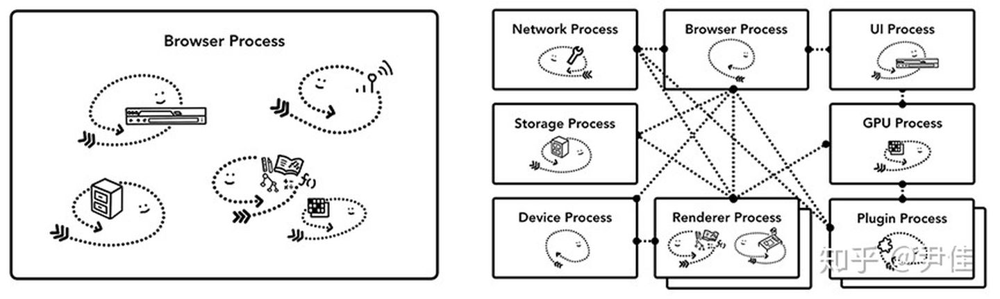

## chrome

- 顶层是浏览器进程（Browser Process）在协调其他进程，这些进程关注着浏览器的不同部分。
  - 渲染器进程（Renderer Process），**多个**渲染器进程会被创建并分配给各个标签页。
- 直到最近，Chrome 都尽可能为一个标签页分配一个进程；现在它尝试着为每个站点都分配自己的进程，包括每个 iframes （见站点隔离）。

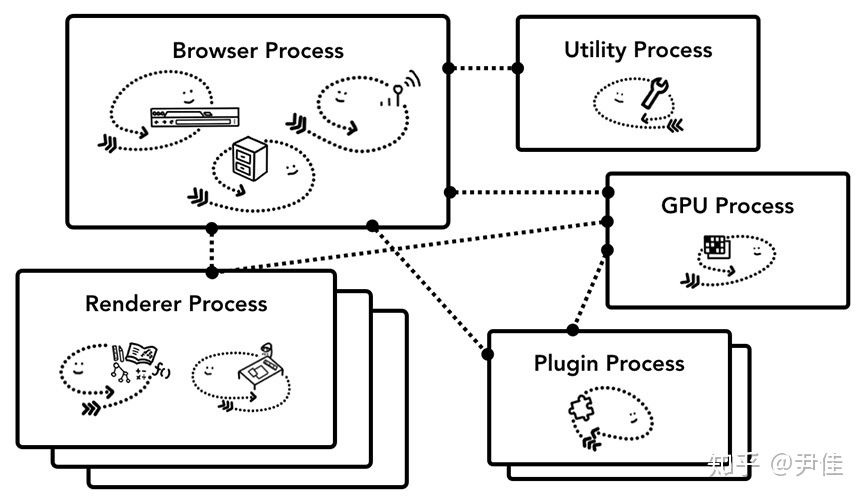
Chrome 多进程架构图，渲染器进程有很多层表示 Chrome 为每个 Tab 都运行了渲染器进程

### 进程的职责

各类 Chrome 进程和他们职责：

- 浏览器进程（Browser）：控制地址栏、书签、前进和后退等按钮，同时处理浏览器中不可见的及特权的部分，比如：网络请求和文件访问；
- 渲染器进程（Renderer）：处理一个标签页的任何内部事件；
- 插件进程（Plugin）：控制网站使用的各个插件，如：flash；
- GPU 进程（GPU）：处理与其他进程隔离的 GPU 任务。分开成不同的进程，是因为 GPU 要处理来自同个窗口的多个应用的请求。

- 还有更多的：扩展进程（Extension Process）和辅助进程（Utility Process）。如果想了解你的 Chrome 运行了多少进程，点击右上角的菜单按钮，选择“更多工具-任务管理器”，就打开了一个包含当前运行进程列表的窗口，展示它们分别占用多少 CPU /内存。

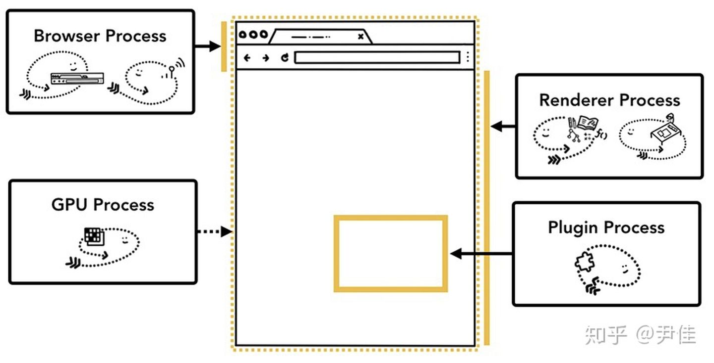
不同进程负责浏览器 UI 的不同部分

### chrome 多进程架构的好处

之前提到 Chrome 使用了多个渲染器进程。

- 渲染引擎独立，保证各个标签互不影响：假设你打开了 3 个标签页，每个标签页运行着独立的渲染器进程，如果其中一个变成没有响应，然后你关闭没有响应的标签，前进到其他保持存活的标签。但假如所有标签页都运行在一个进程中，当其中一个没有响应的时候，所有标签页都会变为没有响应，这是一件令人悲伤的事情。
- 提供了安全和沙箱：把浏览器的工作分开到多个进程中带来的另一个好处是安全和沙盒化，自从操作系统提供了限制进程权限的方法，浏览器根据明确的功能，通过沙盒机制来限制特定进程的权限。

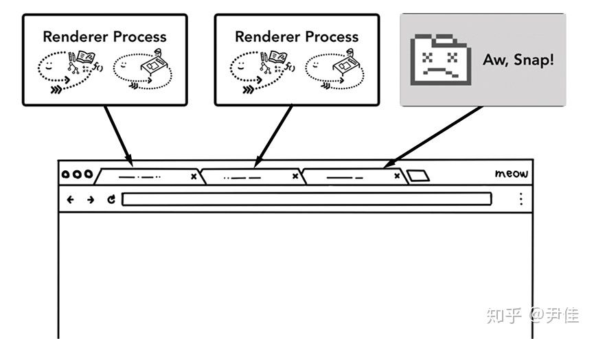
多个进程运行在各个标签页

节约更多内存-Chrome Servicification

> 为了节省内存，Chrome 限制了自己创建进程的数量，这个数量依赖于你的设备拥有多少内存和 CPU 能力，当达到限制时，Chrome 开始在一个进程运行来自同个站点的多个标签页。

### 面向服务的架构

Chrome 将架构从多进程模型转变成面向服务。浏览器将功能以服务的方式提供，以解决多进程架构中的问题。

整体的想法是，当 Chrome 运行在一个性能强劲的设备时，它可以划分不同服务到不同进程中，带来了更多的稳定性，但是如果运行在一个资源受限的设备时，Chrome 整合这些服务到一个进程中，以节约内存。在 Chrome 这种架构变化前，通过整合进程来实现更少内存占用的方法，已经被一些平台所使用（Android）。

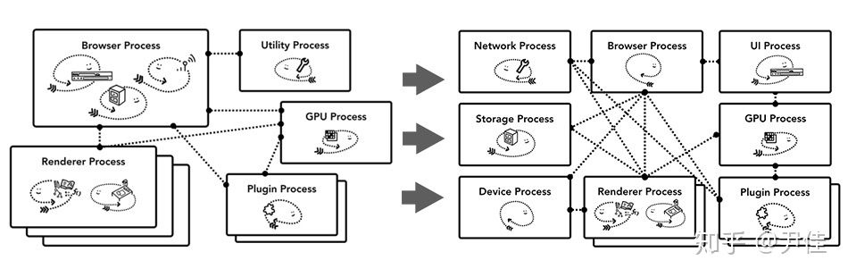
Chrome Servicification 图示，可以移动不同服务到多个进程中（针对性能好的设备）

### Per-frame renderer processes - 站点隔离

站点隔离是 Chrome 最近引入的特性，为每个跨站点的 iframe 运行一个独立的渲染器进程。

桌面版的 Chrome 67 版本默认启用站点隔离，同一标签页下跨站点的 iframe 拥有独立的渲染器进程。

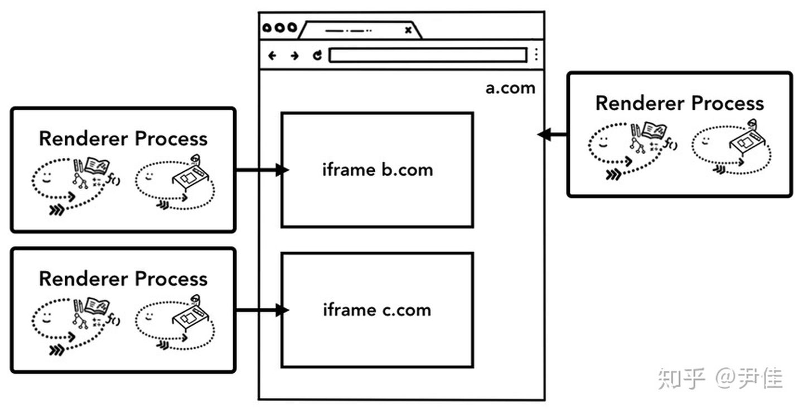
站点隔离图示，多个渲染器进程指向了一个页面内的多个 iframe

## 结论

chrome 是个多进程架构，不同进程通过 ipc 进行通信。当资源受限的时候，会把

---

## 导航过程中发生了什么

### 从浏览器进程开始

在标签页外部发生的一切事情，都由浏览器进程去处理。

- UI 线程负责按钮和输入框的绘制；
- 网络线程处理网络栈，从互联网获取数据；
- 存储线程控制文件的访问等。

当你在地址栏输入 URL ，浏览器进程中的 UI 线程会处理你的输入。

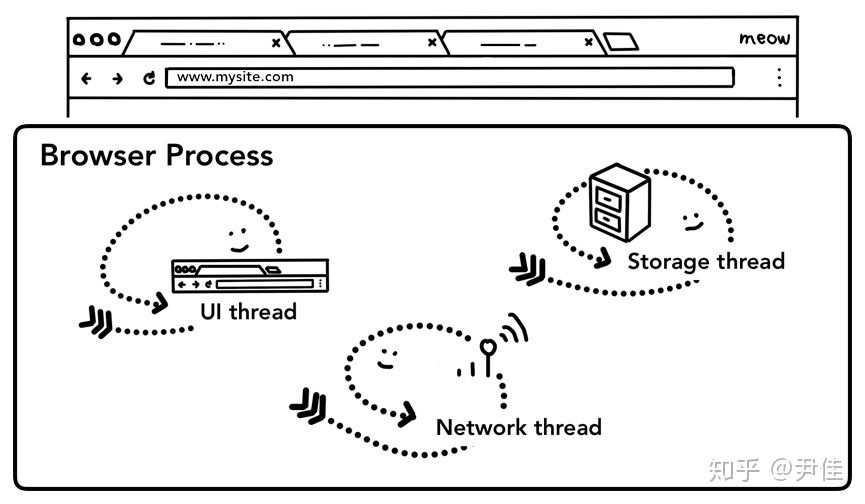
上部分是浏览器界面，下部分是浏览器进程（包括 UI、网络和存储线程）

### 1. 一次简单的导航

当用户开始在地址栏输入内容，UI 线程发出的第一个疑问就是：这是一个搜索关键字，还是 URL ？在 Chrome 中，地址栏同时也是搜索输入框，所以 UI 线程需要进行解析，然后决定将你的输入发给搜索引擎，或者转到访问的网站。

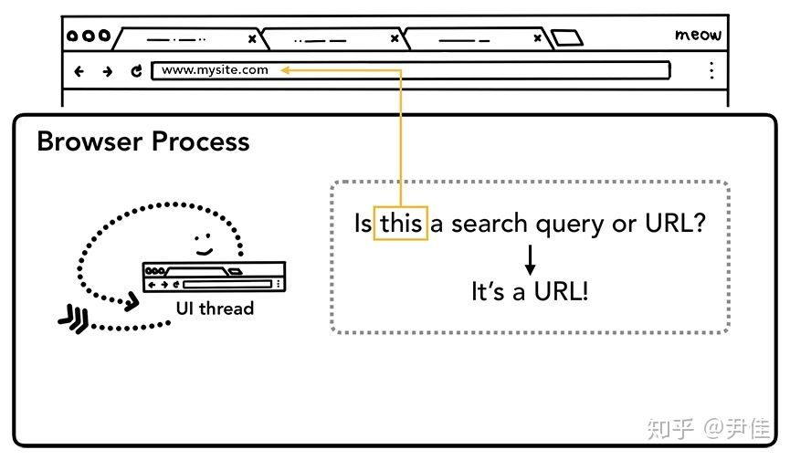

### 2. 开始导航

当用户按下了 Enter ，UI 线程（向网络线程）发了一次网络呼叫来获取网站的内容，加载中的图标会出现在标签卡的左侧。网络线程会经历一些正常的协议处理（流程），如 DNS 查询、为请求建立 TLS 连接。

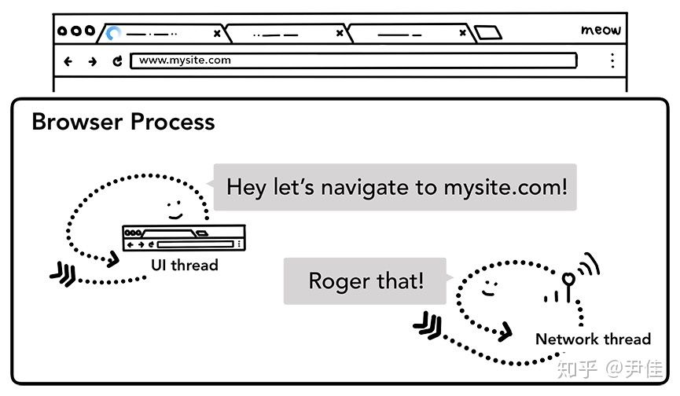

还有一点是，网络线程可能会收到服务器重定向的响应头，如 HTTP 301。在这种情况下，网络线程会通知 UI 线程收到了服务器的重定向信息。然后，另一个 URL 请求就开始了。

### 3. 读取响应

- 一旦响应体（payload）开始到来，网络线程在必要的情况下会检查响应流的初始几个字节。响应头部 Content-Type 可以说明这些数据的类型。
- 如果响应是一份 HTML 文件，下一步就是把这些数据交给渲染器进程，而如果是 ZIP 或其他文件，那么就意味着这是一个下载请求，所以它们需要传给下载管理器。
- 这里也会进行安全浏览检查，如果域名和响应数据看起来和已知的恶意站点相符，网络线程会进行报告，并展示一个 Warning 页面。
- 一旦全部检查已经完成，并且网络线程确保浏览器应该被导航到所请求的站点上，这时网络线程通知 UI 线程所有数据已准备好，UI 线程就找到一个渲染器进程来负责渲染页面。
- 一次网络请求可能需要花费几百毫秒等待响应返回，这里用了一个优化来加速上面的流程。在第二步 UI 线程向网络线程发送 URL 信息时，它已经知道要导航到哪个网站。在网络线程发起请求的同时，UI 线程尝试着寻找或创建一个渲染器进程。这种方式下，一切正常的话，在网络线程收到数据的时候，已经有一个渲染器进程处于待命状态了。但如果遇到跨站点重定向，就不能使用这个渲染器进程，这种情况可能需要另外一个进程。

### 子资源的加载

一个网站通常还会使用类似图片，样式文件和 JavaScript 代码等额外的资源。这些资源也需要从网络或缓存中获取。主线程在转化 HTML 的过程中会挨个加载它们，但是为了提高效率，预加载扫描（Preload Scanner）与转换过程同时运行着。当预加载扫描在分析器分析 HTML 过程中发现了类似 img 或 link 这样的标签时，就会发送请求给浏览器进程的网络线程，而主线程会根据这些额外资源是否会阻塞转化过程而决定是否等待资源加载完毕

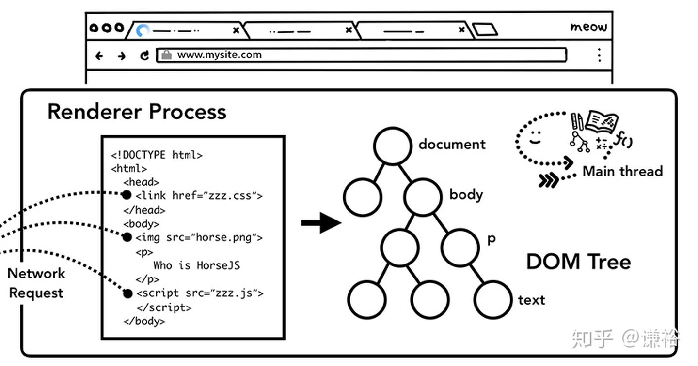

### JavaScript 会阻塞转化过程

当 HTML 分析器发现<script>标签时，会暂停接下来的 HTML 转化工作，然后加载、解析并且运行 Javascript 代码。因为在 Javascript 代码中可能会使用类似 document.write 这样的 API 去改变 DOM 的结构。这就是为什么 HTML 分析器必须等待 Javascript 代码运行结束才能继续分析的原因。

### async 或 defer

如果我们的 Javascript 代码并不需要改变 DOM，可以为<script>标签添加 async 或 defer 属性，这样浏览器就会异步的加载这些资源并且不会阻塞 HTML 转化过程。如果 script 标签是由 JavaScript 代码创建的，标签的 async 属性会默认为 true。同时我们也可以使用一些预加载技术，比如<link ref="preload">来通知浏览器这些资源需要越快下载越好。

### 布局

布局是为元素指定几何信息的过程。主线程遍历 DOM 结构中的元素及其样式，同时创建出带有坐标和元素尺寸信息的布局树（Layout tree）。布局树的结构与 DOM 树的结构十分相似，但只包含将会在页面中显示的元素。当一个元素的样式被设置成 display: none 时，元素就不会出现在布局树中，但那些样式被设置成 visiblility：hidden 的元素会出现在布局树中。相似的，当我们使用一个包含内容的伪元素（例如 p::before { content: 'Hi!' }）时，元素会出现在布局树中即使这个元素不存在于 DOM 树中，这也是为什么我们使用 DOM 提供的 API 无法获取伪元素的原因。

### 绘制

有了 DOM、样式和布局还是无法完成渲染工作。试想，当我们试图复制一张图画。我们知道图画中元素的尺寸、形状和位置，我们还需要知道绘制这些元素的顺序。

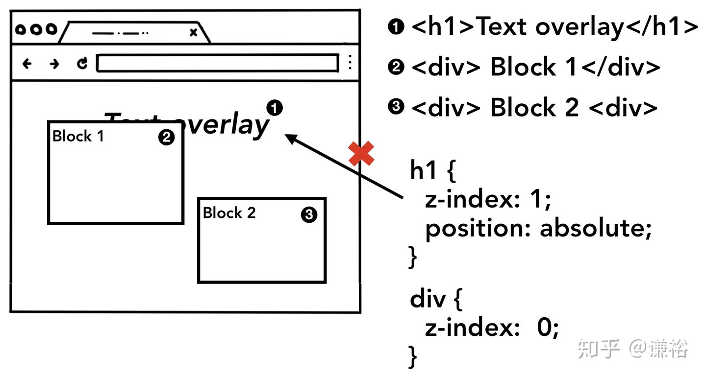

在这个阶段，主线程遍历布局树并创建绘制记录，绘制记录是一系列由绘制步骤组成的流程，例如先绘制背景，然后是文字，然后是形状。

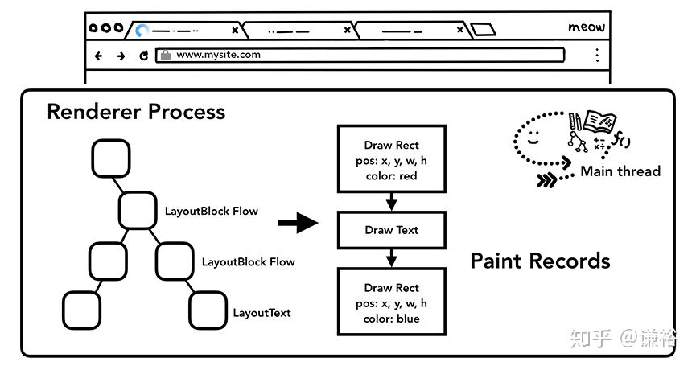

### 合成（Compositing）

现在，浏览器已经知道了文档结构、每一个元素的样式，元素的几何信息，绘制的顺序。将这些信息转化成屏幕上像素的过程叫做光栅化，光栅化是图形学的范畴。

合成是一种将页面划分成不同图层的技术，不同的层可以独立地栅格化，并且通过合成器线程将层合成后形成页面。如果页面发生滚动，需要做的事情就是再合成一个新帧，动画也可以通过相同的方式实现：移动动画层，然后不断合成新帧。

### 分层

为了找出每个元素对应的层，主线程遍历布局树来生成层树（这个部分在 DevTools 的 Performance 面板-更新层树 中）。如果页面中应该被分层的部分没有被分层（滑动式侧边栏菜单），可以在 CSS 中添加 will-change 属性提示浏览器。

> 你可能考虑到给每个元素分配一层，但是合成层处理过多的层数时，操作效率会低于每一帧只栅格化页面的一小部分。

### 主线程中的栅格化和合成

创建了层树和绘制顺序后，主线程提交信息到合成器线程，合成器线程会对每一层进行栅格化。一层的尺寸可能和页面一般大，合成器线程将它们分块成磁贴后，送至栅格线程，栅格线程对磁贴进行栅格化，存储到 GPU 内存中。

合成器线程会按磁贴的优先级分发给不同的栅格线程，这样在视口中（或附近）的磁贴能先被处理。一层还有多个分辨率的磁贴，来处理类似页面缩放的行为。

合成器线程将合成帧通过 IPC 发送给浏览器进程，同时也有其他来源的合成帧被加进来：浏览器的 UI 合成帧、扩展程序的合成帧。这些合成帧传到 GPU 后，展示在显示器中。发生滚动事件时，合成器线程生成新的合成帧发送给 GPU。

> 合成好处是，可独立完成并且和主线程无关，合成器线程无需等待样式计算和 JavaScript 执行，这是合成器动画能达到最佳平滑表现的原因。不过当布局和绘制需要重新计算时，就必须调用主线程了。

> 本质上，浏览器的渲染过程就是将文本转换成图像的过程，而当用户与页面发生交互动作时，则显示新的图像。在这个过程中由渲染进程中的主线程完成计算工作，由合成线程和栅格线程完成图像的绘制工作。而在计算过程中，还有强制布局、重排、重绘等更加细节的概念会在后面的文章中做讲解。

### 合成线程对事件的处理

> 由于运行 Javascript 是主线程的工作，当页面被合成线程合成过，合成线程会标记那些有事件监听的区域。有了这些信息，当事件发生在响应的区域时，合成线程就会将事件发送给主线程处理。如果在非事件监听区域，则渲染进程直接创建新的帧而不关心主线程。

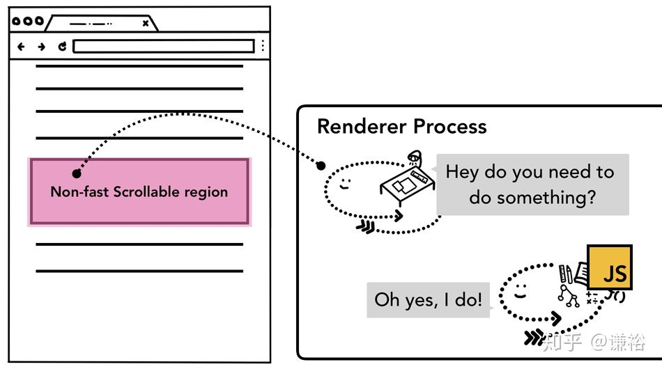

### 在事件监听时标记

在 web 开发中常见的方式就是事件代理。利用事件冒泡，我们可以在目标元素的上层元素中监听事件。参照下面的代码。

```js
document.body.addEventListener('touchstart', (event) => {
  if (event.target === area) {
    event.preventDefault()
  }
})
```

通过这种写法，可以更高效的监听事件。但如果从浏览器的角度看，此时整个页面会被标记成“慢滚动”区域。这意味着虽然页面中的某些部分并不需要事件监听，但合成线程依然要在每次交互发生后等待主线程处理事件，合成线程的优化效果不复存在。

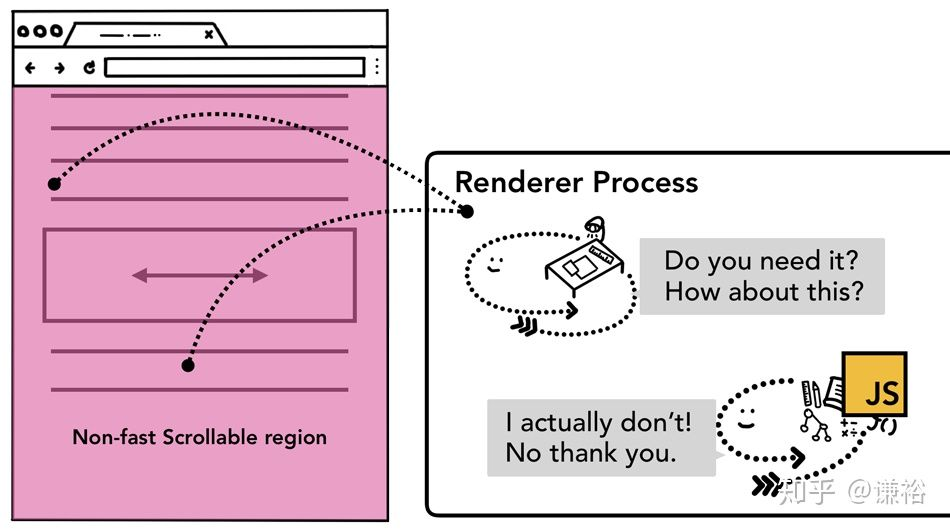

为了解决这个问题，我们可在事件代理时传入 passive: true（IE 不支持）参数。这样告诉渲染线程，依然需要将事件发送给主线程处理，但不需要等待。针对于 document、document.body 的 touchstart 和 touchmove 默认都是为 true 的。

### 查找事件目标

当渲染线程将事件发送给主线程后，第一件事就是找到事件触发的目标。通过在渲染过程中生成的绘制信息，可以根据坐标找到目标元素。

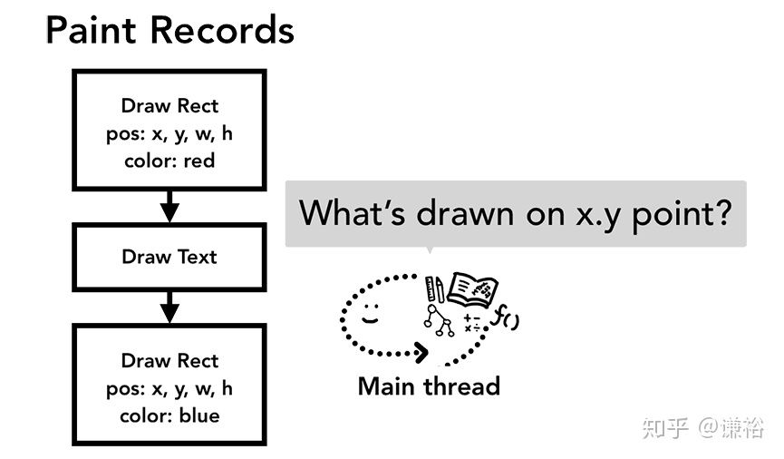

### 减少发送给主线程的事件数量

为了保证动画的顺畅，需要显示器在每秒刷新 60 次。对于典型的触摸事件由合成线程提交给主线程的事件频率可以达到每秒 60-120 次，对于典型的鼠标事件每秒会发送 100 次。事件发送的频率通常比屏幕刷新频率要高。

为了减少发送给主线程的事件数量，Chrome 合并了连续的事件。类似 wheel，mousewheel，mousemove，pointermove，touchmove 这样的事件会被延迟到下一次 requestAnimationFrame 前触发.
