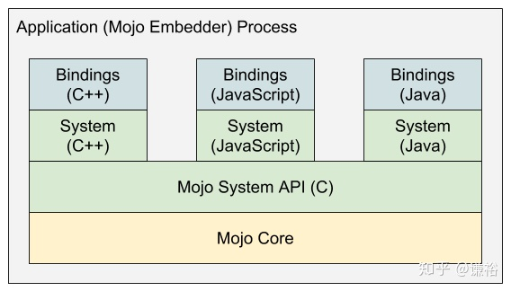

## 进程

从安全的角度考虑，让不同的站点保持相互隔离是非常重要的，这被称作站点隔离（Site Isolation）。理论上讲，一个渲染进程应该最多只能负责一个站点的渲染工作。但实际上，当用户打开很多页签时，渲染进程与站点 1 对 1 的关系会占用大量的内存。所以一个渲染进程可能会被多个 iframe 或页签所共享，也就是说一个页面中的多个 iframe 可能被多个渲染进程渲染，而在不同页面中的多个 iframe 也可能被同一个渲染进程渲染。

> 所以，在 iframe，页签和渲染进程间并不存在一对一的关系。

由于 Blink 运行在渲染进程中的沙盒中，当 Blink 需要访问文件或播放视频或者访问用户信息（cookie、password 等）时必须与浏览器进程通信。这种不同进程间的通信方式被 Mojo 实现。随着 Chromium 不断向服务化架构演进，Blink 可以通过 Mojo 来降低消息传递过程中对发送方和接收方对于具体实现的依赖（服务可能在多个进程中，也可能在同一个进程中，消息传递方式不同）

## Mojo

Mojo 是一系列库的集合，用于提供一种进程内或跨进程的通信方案，其中包含了与平台无关的通用的 IPC 方案、消息 IDL 格式化和可以与不同语言集成的绑定库。

## 线程
Blink包含一个主线程，多个Worker线程，还有一些其他的线程。

几乎所有重要的工作都运行在主线程上。包括运行JavaScript（除了Workers），DOM生成，CSS样式和布局计算等，所以交互性能的优化关键主要围绕主线程。
