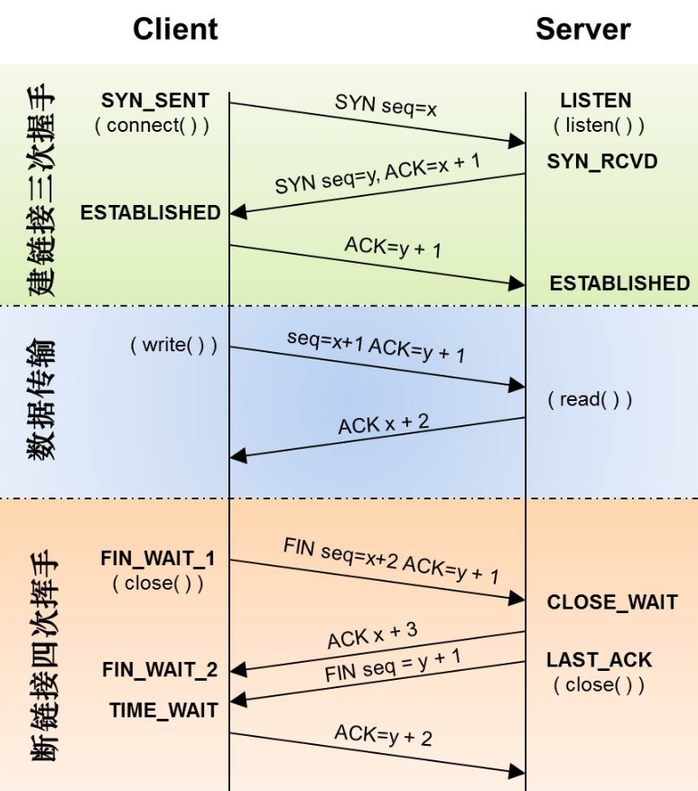
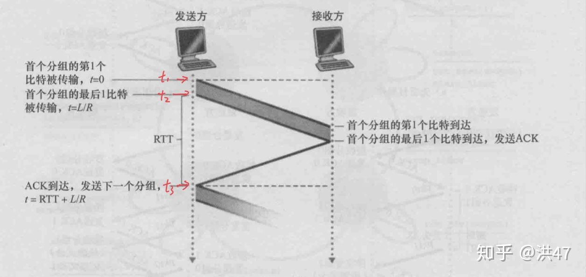

## 状态码

### 204 No Content(没有内容)

返回的 Response 中只有一些 Header 和一个状态行， 没有实体的主题内容（没有 response body）

- 在不获取资源的情况下了解资源的情况（比如判断类型）
- 通过查看 Header，查看资源是否被修改等等
- 主要是用在 cors 跨域处理中，如果遇到非简单请求，浏览器会发出，option 请求，这个时候浏览器可以把相关的 header 返回给浏览器，并标识状态码 204

### 206 Partial Content(部分内容)

206 状态码代表服务器已经成功处理了部分 GET 请求（只有发送 GET 方法的 request, web 服务器才可能返回 206）

应用场景：

1. 迅雷或者 HTTP 下载工具
2. 大文档分解为多个下载段同时下周。可以使用 206

- http 302 301 307 的区别
- 301 和 302 哪个对 seo 更友好（301）

```
打开Fiddler， 然后用浏览器打开“搜狐视频中的绿箭侠” http://tv.sohu.com/20121011/n354681393.shtml 然后你在Fiddler中就能看到一堆的206
1. 浏览器发送一个Get 方法的request. header中包含 Range: bytes=5303296-5336063. (意思就是请求得到5303296-5336063这个范围的数据)。
2. Web服务器返回一个206 的Response. header中包含Content-Range: bytes 5303296-5336063/12129376(表明这次返回的内容范围)
```

###

### keep-alive

keep-alive 机制：若开启后，在一次 http 请求中，服务器进行响应后，不再直接断开 TCP 连接，而是将 TCP 连接维持一段时间。在这段时间内，如果同一客户端再次向服务端发起 http 请求，便可以复用此 TCP 连接，向服务端发起请求，并重置 timeout 时间计数器，在接下来一段时间内还可以继续复用。这样无疑省略了反复创建和销毁 TCP 连接的损耗。

所以引入了 keep-alive 机制。http1.0 默认是关闭的，通过 http 请求头设置“connection: keep-alive”进行开启；http1.1 中默认开启，通过 http 请求头设置“connection: close”关闭。

> HTTP keep-alive 章节的实验结果：无论开启 keep-alive 与否，最终由服务端主动断开 TCP 连接。

## 分层

- 将复杂的流程分为几个功能相对单一的子进程
- 整个流程更加清晰，复杂问题简单化
- 更容易发现问题并针对性的解决问题

网络五层结构

- TCP/IP 是传输控制协议/网络互联网协议的检查

- 应用层
- 传输层
- 网络层
- 数据链路层
- 物理层

## TCP/UDP

- http://interview.poetries.top/docs/excellent.html#_31-1-udp

### 1. UDP

- 面向无连接
  - UDP 不需要和 TCP 一样在发送数据前进行三次握手简历连接，想发就开始发送
  - 并且也只是数据报文的搬运工，不会对数据报文进行任何拆分和拼接操作。
  - 在发送端，应用层将数据传递给传输层的 UDP 协议，UDP 只会给数据增加一个 UDP 头标识下是 UDP 协议，然后就传递给网络层了 在接收端，网络层将数据传递给传输层，UDP 只去除 IP 报文头就传递给应用层，不会任何拼接操作
- 不可靠性
  - 首先不可靠性体现在无连接上
  - 发送数据也不会关心对方是否已经正确接收到数据了
  - 网络环境时好时坏，UDP 一直会以恒定的速度发送数据。
- 高效
  - 虽然，UDP 协议不可靠，但是头部开销小：
    - 两个十六位的端口号（源端口和目标端口）
    - 整个数据报文的校验
- 传输方式
  - UDP 提供了单播，多播，广播的功能

场景：

- 直播
- 游戏

### 2. TCP

TCP 基本是和 UDP 反着来，建立连接断开连接都需要先需要进行握手。在传输数据的过程中，通过各种算法保证数据的可靠性，当然带来的问题就是相比 UDP 来说不那么的高效

- TCP headers

  - Sequence number：这个序号保证了 TCP 传输的报文都是有序的，对端可以通过序号顺序的拼接报文。
  - Acknowledgement Number，这个序号表示数据接收端期望接收的下一个字节的编号是多少，同时也表示上一个序号的数据已经收到。
  - Window Size，窗口大小，表示还能接收多少字节的数据，用于流量控制。
  - 标识符：
    - URG=1：表示本数据包的数据部分包含紧急信息，是一个高优先级数据报文，此时紧急指针有效。紧急数据一定当前数据包数据不符的最前面，紧急指针标明了紧急数据的尾部。
    - ACK=1：该字段表示确认号字段有效。
    - PSH=1：该字段为 1 表示接收端应该立即将数据 push 给应用层，而不是等到缓冲区满后再提交。
    - RST=1：该字段为 1 表示当前 TCP 连接出现严重问题，可能需要重新建立 TCP 连接，也可以用于拒绝非法的报文段和拒绝连接请求。
    - SYN=1：当 SYN=1，ACK=0 时，表示当前报文段是一个连接请求报文。当 SYN=1，ACK=1 时，表示当前报文段是一个同意建立连接的应答报文。
    - FIN=1：该字段为一表示此报文段是一个释放连接的请求报文。



- 三次握手

  - 第一次握手： 客户端向服务端发送连接请求报文段。该报文段中包含自身的数据通讯初始序号。请求发送后，客户端便进入 SYN-SENT 状态
  - 第二次握手： 服务端收到连接请求报文段后，如果同意连接，则会发送一个应答，该应答中也会包含自身的数据通讯初始序号，发送完成后便进入 SYN-RECEIVED 状态
  - 第三次握手： 当客户端收到连接同意的应答后，还要向服务端发送一个确认报文。客户端发完这个报文段后便进入 ESTABLISHED 状态，服务端收到这个应答后也进入 ESTABLISHED 状态，此时连接建立成功。
  - PS：第三次握手中可以包含数据，通过快速打开（TFO）技术就可以实现这一功能。其实只要涉及到握手的协议，都可以使用类似 TFO 的方式，客户端和服务端存储相同的 cookie，下次握手时发出 cookie 达到减少 RTT 的目的。

- 为什么 TCP 建立连接需要三次握手，明明两次就可以建立起连接？

  - 为了防止出现失效的连接请求报文段被服务端接收的情况，从而产生错误。
  - 可以想象如下场景。客户端发送了一个连接请求 A，但是因为网络原因造成了超时，这时 TCP 会启动超时重传的机制再次发送一个连接请求 B。此时请求顺利到达服务端，服务端应答完就建立了请求，然后接收数据后释放了连接。
    - 假设这时候连接请求 A 在两端关闭后终于抵达了服务端，那么此时服务端会认为客户端又需要建立 TCP 连接，从而应答了该请求并进入 ESTABLISHED 状态。但是客户端其实是 CLOSED 的状态，那么就会导致服务端一直等待，造成资源的浪费。
    - PS：在建立连接中，任意一端掉线，TCP 都会重发 SYN 包，一般会重试五次，在建立连接中可能会遇到 SYN Flood 攻击。遇到这种情况你可以选择调低重试次数或者干脆在不能处理的情况下拒绝请求

#### 断开


TCP 是全双工的，在断开连接时两端都需要发送 FIN 和 ACK

- 第一次握手： 若客户端 A 认为数据发送完成，则它需要向服务端 B 发送连接释放请求。
- 第二次握手： B 收到连接释放请求后，会告诉应用层要释放 TCP 链接。然后会发送 ACK 包，并进入 CLOSE_WAIT 状态，此时表明 A 到 B 的连接已经释放，不再接收 A 发的数据了。但是因为 TCP 连接是双向的，所以 B 仍旧可以发送数据给 A

- ARQ 协议： ARQ 协议也就是超时重传机制。通过确认和超时机制保证了数据的正确送达，ARQ 协议包含停止等待 ARQ 和连续 ARQ 两种协议。

  - 正常传输过程： 只要 A 向 B 发送一段报文，都要停止发送并启动一个定时器，等待对端回应，在定时器时间内接收到对端应答就取消定时器并发送下一段报文。
  - 报文丢失或出错：
    - 在报文传输的过程中可能会出现丢包。这时候超过定时器设定的时间就会再次发送丢失的数据直到对端响应，所以需要每次都备份发送的数据。
    - 即使报文正常的传输到对端，也可能出现在传输过程中报文出错的问题。这时候对端会抛弃该报文并等待 A 端重传。
    - 一般定时器设定的时间都会大于一个 RTT 的平均时间。

- 第三次握手： B 如果此时还有没发完的数据会继续发送，完毕后会向 A 发送连接释放请求，然后 B 便进入 LAST-ACK 状态。
  - PS：通过延迟确认的技术（通常有时间限制，否则对方会误认为需要重传），可以将第二次和第三次握手合并，延迟 ACK 包的发送。
- 第四次握手： A 收到释放请求后，向 B 发送确认应答，此时 A 进入 TIME-WAIT 状态。该状态会持续 2MSL（最大段生存期，指报文段在网络中生存的时间，超时会被抛弃） 时间，若该时间段内没有 B 的重发请求的话，就进入 CLOSED 状态。当 B 收到确认应答后，也便进入 CLOSED 状态。

  - 为什么 A 要进入 TIME-WAIT 状态，等待 2MSL 时间后才进入 CLOSED 状态？
  - 为了保证 B 能收到 A 的确认应答。若 A 发完确认应答后直接进入 CLOSED 状态，如果确认应答因为网络问题一直没有到达，那么会造成 B 不能正常关闭。

- ACK 超时或丢失
  - 对端传输的应答也可能出现丢失或超时的情况。那么超过定时器时间 A 端照样会重传报文。这时候 B 端收到相同序号的报文会丢弃该报文并重传应答，直到 A 端发送下一个序号的报文。
  - 在超时的情况下也可能出现应答很迟到达，这时 A 端会判断该序号是否已经接收过，如果接收过只需要丢弃应答即可。

#### 连续 ARQ

从上面的描述中大家肯定可以发现这肯定不是一个高效的方式。假设在良好的网络环境中，每次发送数据都需要等待片刻肯定是不能接受的。那么既然我们不能接受这个不那么高效的协议，就来继续学习相对高效的协议吧。

在连续 ARQ 中，发送端拥有一个发送窗口，可以在没有收到应答的情况下持续发送窗口内的数据，这样相比停止等待 ARQ 协议来说减少了等待时间，提高了效率。

##### 累计确认

连续 ARQ 中，接收端会持续不断收到报文。如果和停止等待 ARQ 中接收一个报文就发送一个应答一样，就太浪费资源了。通过累计确认，可以在收到多个报文以后统一回复一个应答报文。报文中的 ACK 标志位可以用来告诉发送端这个序号之前的数据已经全部接收到了，下次请发送这个序号后的数据。

但是累计确认也有一个弊端。在连续接收报文时，可能会遇到接收到序号 5 的报文后，并未接收到序号 6 的报文，然而序号 7 以后的报文已经接收。遇到这种情况时，ACK 只能回复 6，这样就会造成发送端重复发送数据的情况

##### 滑动窗口

上面小节中讲到了发送窗口。在 TCP 中，两端其实都维护着窗口：分别为发送端窗口和接收端窗口。

- 发送端窗口包含已发送但未收到应答的数据和可以发送但是未发送的数据。
- 发送端窗口是由接收窗口剩余大小决定的。接收方会把当前接收窗口的剩余大小写入应答报文，发送端收到应答后根据该值和当前网络拥塞情况设置发送窗口的大小，所以发送窗口的大小是不断变化的。
- 当发送端接收到应答报文后，会随之将窗口进行滑动

> 滑动窗口是一个很重要的概念，它帮助 TCP 实现了流量控制的功能。接收方通过报文告知发送方还可以发送多少数据，从而保证接收方能够来得及接收数据，防止出现接收方带宽已满，但是发送方还一直发送数据的情况

#### 处理 拥塞

- 拥塞处理和流量控制不同，后者是作用于接收方，保证接收方来得及接受数据。而前者是作用于网络，防止过多的数据拥塞网络，避免出现网络负载过大的情况。
- 拥塞处理包括了四个算法，分别为：慢开始，拥塞避免，快速重传，快速恢复

##### 慢开始

- 慢开始算法，顾名思义，就是在传输开始时将发送窗口慢慢指数级扩大，从而避免一开始就传输大量数据导致网络拥塞。想必大家都下载过资源，每当我们开始下载的时候都会发现下载速度是慢慢提升的，而不是一蹴而就直接拉满带宽
- 连接初始设置拥塞窗口（Congestion Window） 为 1 MSS（一个分段的最大数据量）
- 每过一个 RTT 就将窗口大小乘二
- 指数级增长肯定不能没有限制的，所以有一个阈值限制，当窗口大小大于阈值时就会启动拥塞避免算法。

拥塞避免算法

- 拥塞避免算法相比简单点，每过一个 RTT 窗口大小只加一，这样能够避免指数级增长导致网络拥塞，慢慢将大小调整到最佳值。
- 在传输过程中可能定时器超时的情况，这时候 TCP 会认为网络拥塞了，会马上进行以下步骤：
  - 将阈值设为当前拥塞窗口的一半
  - 将拥塞窗口设为 1 MSS
  - 启动拥塞避免算法

##### 快速重传

> 快速重传一般和快恢复一起出现。一旦接收端收到的报文出现失序的情况，接收端只会回复最后一个顺序正确的报文序号。如果发送端收到三个重复的 ACK，无需等待定时器超时而是直接启动快速重传算法。具体算法分为两种：

- 将阈值设为当前拥塞窗口的一半
- 将拥塞窗口设为 1 MSS
- 重新开始慢开始算法
- TCP Reno 实现如下

### 补充

- https://www.zhihu.com/question/39244840



t1 为发送第一个比特的时刻

t2 为发完最后一个比特的时刻

t3 为接收到确认信号的时刻

图中明确指出：RTT = t3 - t2

## http

HTTP 请求由三部分构成，分别为：

- 请求行
  - 请求行大概长这样 GET /images/logo.gif HTTP/1.1，基本由请求方法、URL、协议版本组成，这其中值得一说的就是请求方法了。
- headers
- 实体

## http3.0

https://baijiahao.baidu.com/s?id=1668491306781063915&wfr=spider&for=pc

## 参考

- https://juejin.cn/post/6844904100035821575

- http2: https://zhuanlan.zhihu.com/p/29609078
  https://zhuanlan.zhihu.com/p/40902149

## 报文

request

```
GET /Protocols/rfc2616/rfc2616-sec5.html HTTP/1.1
Host: www.w3.org
Connection: keep-alive
Cache-Control: max-age=0
Accept: text/html,application/xhtml+xml,application/xml;q=0.9,image/webp,*/*;q=0.8
User-Agent: Mozilla/5.0 (Windows NT 6.1; WOW64) AppleWebKit/537.36 (KHTML, like Gecko) Chrome/35.0.1916.153 Safari/537.36
Referer: https://www.google.com.hk/
Accept-Encoding: gzip,deflate,sdch
Accept-Language: zh-CN,zh;q=0.8,en;q=0.6
Cookie: authorstyle=yes
If-None-Match: "2cc8-3e3073913b100"
If-Modified-Since: Wed, 01 Sep 2004 13:24:52 GMT

name=qiu&age=25
```

response

```
HTTP/1.1 200 OK
Date: Tue, 08 Jul 2014 05:28:43 GMT
Server: Apache/2
Last-Modified: Wed, 01 Sep 2004 13:24:52 GMT
ETag: "40d7-3e3073913b100"
Accept-Ranges: bytes
Content-Length: 16599
Cache-Control: max-age=21600
Expires: Tue, 08 Jul 2014 11:28:43 GMT
P3P: policyref="http://www.w3.org/2001/05/P3P/p3p.xml"
Content-Type: text/html; charset=iso-8859-1

{"name": "qiu", "age": 25}
```

